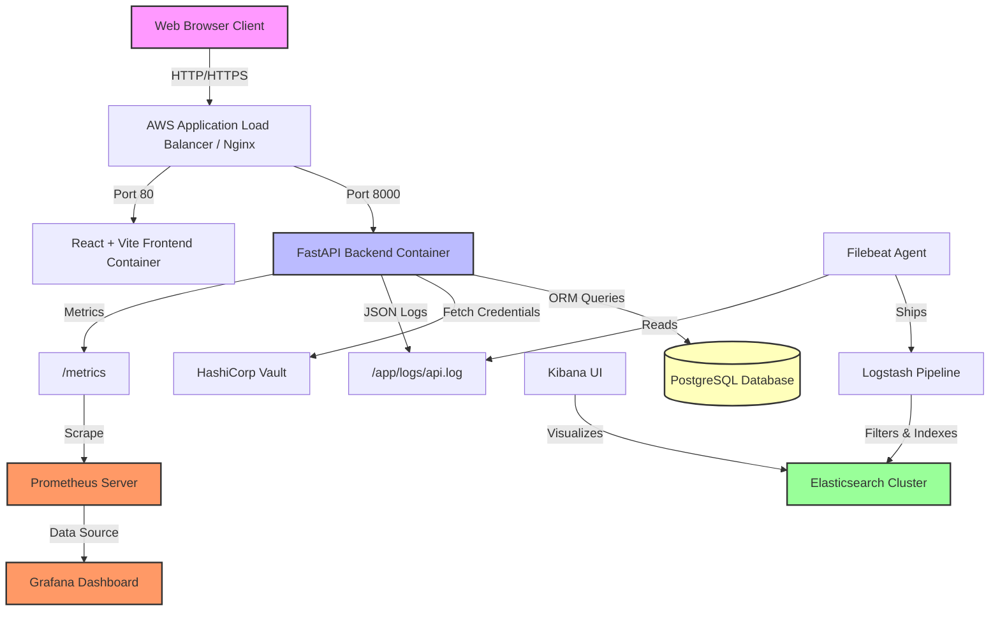

# OmniCivilization Analytics: DevOps & Infrastructure Documentation

This document serves as the comprehensive guide for the **OmniCivilization Analytics** application and its automated DevOps infrastructure. It covers application design, deployment automation, containerization, orchestration, monitoring, logging, secrets management, disaster recovery, an instructor presentation guide, and a comprehensive Viva prep guide.

---

## 1. Executive Summary & Application Overview

**OmniCivilization Analytics** is a futuristic command-center application designed to monitor and manage key global variables across planetary sectors (e.g., Neo-Tokyo, Olympus Mons, Atlantis). It enables administrators and operators to view real-time data, manage key assets (Quantum Fusion Reactors, Tachyon Climate Regulators), simulate events, and assess threat levels.

### The Application Architecture
- **Frontend**: A modern dashboard built with **React**, **TypeScript**, **Vite**, and **Tailwind CSS**. It communicates with the backend via RESTful APIs and updates metrics dynamically.
- **Backend**: Built with **FastAPI** (Python), using **SQLAlchemy** for ORM. The backend provides endpoints for users, regions, assets, and active simulations. It automatically seeds a set of initial mock data if the database is empty.
- **Database**: Supports **SQLite** for lightweight local testing and **PostgreSQL** (deployed via AWS RDS or Kubernetes statefulset) for production-grade persistent storage.

---

## 2. System Architecture & Deployment Diagrams

### 2.1 Logical Architecture Diagram
This diagram shows the system component relationships, showing how requests flow from the client browser to the database, passing through monitoring, logging, and security layers.




### 2.2 Infrastructure Deployment Diagram (AWS / Kubernetes)
This diagram maps out how the application resides on AWS, provisioned by Terraform, and managed by Amazon EKS (Elastic Kubernetes Service).

```mermaid
graph TD
    subgraph AWS VPC
        subgraph Public Subnets
            IGW[Internet Gateway]
            ALB_AWS[AWS ALB]
        end

        subgraph Private Subnets (EKS Cluster)
            subgraph EKS Worker Node 1
                FE_Pod[Frontend Pod]
                BE_Pod[FastAPI Backend Pod]
            end
            subgraph EKS Worker Node 2
                Vault_Pod[HashiCorp Vault Pod]
                Filebeat_Pod[Filebeat DaemonSet]
            end
        end

        subgraph Database Subnets
            RDS_PG[(Amazon RDS PostgreSQL)]
        end
    end

    Internet[Users / CI-CD Runners] --> IGW
    IGW --> ALB_AWS
    ALB_AWS --> FE_Pod
    ALB_AWS --> BE_Pod
    BE_Pod --> RDS_PG
    BE_Pod --> Vault_Pod
```

---

## 3. DevOps Stack Breakdown & Implementation Details

### 3.1 Containerization (Docker)
- **Frontend Dockerfile**: Multi-stage build. Stage 1 compiles the React assets (`npm run build`). Stage 2 copies the compiled static assets (`/app/dist`) into an `nginx:alpine` image to serve the frontend on port 80.
- **Backend Dockerfile**: A lightweight Python environment using `python:3.11-slim`. It sets environment variables, installs requirements, and runs the FastAPI app via `uvicorn` on port 8000.
- **Local Compose (`docker-compose.yml`)**: Spins up the application services together, linking the frontend to the backend container over a common Docker network.

### 3.2 Infrastructure as Code (Terraform)
Located in `terraform/`, the IaC scripts configure:
- **`main.tf` / `providers.tf`**: Sets up the AWS provider and provisions a secure VPC with public/private subnet topology.
- **`eks.tf`**: Provisions an Amazon EKS Cluster with managed node groups.
- **`rds.tf`**: Provisions a PostgreSQL RDS instance within private database subnets.
- **`s3.tf`**: Provisions an S3 bucket to store application assets or Terraform state securely.
- **`iam.tf`**: Defines IAM roles and policies needed for EKS node groups and AWS services access.

### 3.3 CI/CD Automation (GitHub Actions & Jenkins)
The project supports both tools for maximum flexibility:
- **GitHub Actions (`.github/workflows/deploy.yml`)**:
  - Triggers on every push to `main`.
  - Builds frontend and backend Docker images.
  - Pushes images to the GitHub Container Registry (`ghcr.io`).
  - Spins up a test backend container to perform a quick curl-based health check.
  - SSHs into the target EC2 deployment host, copies `docker-compose.yml`, pulls the updated images, and restarts the containers.
- **Jenkinsfile**:
  - Pulls code from repository.
  - Logs into GitHub Container Registry (`ghcr.io`).
  - Builds and pushes the Docker images tagged with the Jenkins `BUILD_NUMBER`.
  - Configures AWS credentials and updates the `kubeconfig` for EKS.
  - Deploys the resources directly to EKS by updating the image in `kubernetes/deployment.yaml` and running `kubectl apply`.

### 3.4 Orchestration (Kubernetes)
The files in `kubernetes/` define:
- **`namespace.yaml`**: Creates a dedicated namespace `omnicivilization`.
- **`deployment.yaml`**: Spins up the FastAPI backend pod. Includes:
  - `imagePullSecrets` for private GHCR repository credentials.
  - Resource requests and limits (CPU/Memory bounds) for stability.
  - **Liveness** and **Readiness** probes pointing to the `/` health checkpoint on port 8000.
- **`service.yaml`**: Defines a LoadBalancer service mapping external port 80 to container port 8000.

### 3.5 Monitoring (Prometheus & Grafana)
FastAPI integrates `prometheus_client` to track HTTP requests and durations.
- **Prometheus Configuration (`monitoring/prometheus.yml`)**: Instructs Prometheus to scrape the `/metrics` endpoint on `omni-backend` every 15 seconds.
- **Grafana Configuration (`monitoring/docker-compose.yml`)**: Launches Grafana alongside Prometheus. Once logged in, developers can import dashboards to visualize request rates, response latency, and system resource utilization.

### 3.6 Centralized Logging (ELK Stack)
Configured under `logging/`:
- **FastAPI Logs**: Writes structured JSON logs into `backend/app/logs/api.log` containing time, status codes, IP, duration, and path.
- **Filebeat**: Mounts the log directory and ships log lines to Logstash.
- **Logstash (`logstash.conf`)**: Receives logs on port 5044, parses JSON logs, and indexes them into Elasticsearch.
- **Kibana**: Serves as the web UI on port 5601 to query and filter indexed log files.

### 3.7 Secret Management (HashiCorp Vault)
- Vault is deployed (either via Docker Compose or Kubernetes pod) to keep database credentials and API keys out of repository code.
- **Configuration (`vault/config.hcl`)**: Enables a file-based storage backend and disables TLS for development/demonstration simplicity.
- **Workflow**: During bootstrapping, secrets are written to Vault (`vault kv put secret/omni-db password=...`). The FastAPI settings layer fetches secrets at startup using the Vault REST API, avoiding hardcoded values in configuration files.

---

## 4. Disaster Recovery (DR) Plan

This DR plan ensures continuity for OmniCivilization Analytics.

### 4.1 RTO and RPO Targets
- **Recovery Time Objective (RTO)**: < 1 Hour (maximum acceptable downtime to restore the command center).
- **Recovery Point Objective (RPO)**: < 15 Minutes (maximum data loss acceptable).

### 4.2 Backup and Recovery Procedures
1. **Database Backups (AWS RDS / PostgreSQL)**:
   - Automated snapshots are enabled with a 7-day retention period.
   - Point-In-Time Recovery (PITR) allows restoration to any second within the retention window.
   - For manual recovery, database backups are scheduled using `pg_dump` every 6 hours and stored in an encrypted, cross-region S3 bucket.
2. **Infrastructure Recovery**:
   - Terraform scripts are version-controlled. If a region goes down, running `terraform apply` in a standby region (e.g., `us-east-1` instead of `us-west-2`) will fully recreate the VPC, EKS cluster, and RDS infrastructure.
3. **Application State & Config**:
   - Application configuration and secrets are versioned/stored in HashiCorp Vault. Vault data is backed up via storage snapshots.
   - Deployment configuration is stored in git; applying `kubectl apply -f kubernetes/` restores all workloads instantly.

### 4.3 Failover & Disaster Scenarios
- **Scenario A: Single Pod Failure**: Kubernetes automatically replaces the degraded container using Readiness/Liveness probes.
- **Scenario B: EKS Node Failure**: EKS auto-scaling groups automatically provision a new node and reschedule pods.
- **Scenario C: Database Corruption**: Restore the database from the last transaction log via RDS PITR.
- **Scenario D: Region Outage**: Run Terraform to stand up a duplicate infrastructure in another region, run CI/CD to push the application, and update DNS records to point to the new Load Balancer.

---

## 5. Guide to Running the Whole Stack Locally

To demonstrate the full stack locally, use the following commands:

### 1. Build and Run the App Stack
```bash
# From root directory, build and launch the frontend and backend application
docker compose up --build -d
```
Access the Frontend dashboard at `http://localhost:80` and the backend Swagger API docs at `http://localhost:8000/docs`.

### 2. Start the ELK Logging Pipeline
```bash
# Navigate to logging folder and run the stack
cd logging
docker compose up -d
```
Access Kibana at `http://localhost:5601`. Create a data view for `omni-logs-*` to view logs.

### 3. Start Prometheus & Grafana Monitoring
```bash
# Navigate to monitoring folder and run the stack
cd ../monitoring
docker compose up -d
```
Access Prometheus at `http://localhost:9090` and Grafana at `http://localhost:3000` (default login: `admin`/`admin`).

### 4. Start Secret Management with Vault
```bash
# Navigate to vault folder and run the stack
cd ../vault
docker compose up -d
```
Access Vault UI at `http://localhost:8200`.

---

## 6. Instructor Presentation Script

When demonstrating this project, follow this structured breakdown to highlight the DevOps automation values:

1. **Introduction (1 min)**:
   - *"Good morning/afternoon, Instructor. Today we are presenting our DevOps automation project for OmniCivilization Analytics. We built a fully functional React + FastAPI microservice application, and automated its lifecycle from infrastructure provisioning to deployment, monitoring, and security."*
2. **Showcase the Running Application (1.5 mins)**:
   - Open the web application on `http://localhost:80` (or the deployed public URL).
   - Demonstrate modifying a planetary sector's threat level or simulating a crisis. Highlight how the UI responds in real-time.
3. **Infrastructure as Code & CI/CD (2 mins)**:
   - Show the Terraform files: Explain how it provisions the VPC, EKS cluster, and RDS database dynamically.
   - Open GitHub Actions / Jenkins: Show a successful pipeline execution. Highlight how pushing code automatically triggers linting, building Docker images, uploading to GHCR, running automated health-check integration tests, and deploying to Kubernetes.
4. **Resiliency & Orchestration (1.5 mins)**:
   - Explain how Kubernetes manages the containers. Show `deployment.yaml` configuration focusing on readiness/liveness probes and resource limits.
   - Mention the Disaster Recovery Plan: *"We have a defined DR strategy with RDS automated backups and Terraform multi-region capability to guarantee an RTO under 1 hour."*
5. **Observability & Logging (2 mins)**:
   - Open Grafana: Show request volume metrics scraped from FastAPI `/metrics`.
   - Open Kibana: Show structured JSON logs that Filebeat shipped from the API container. Perform a search for a `400` status code.
6. **Secrets & Security (1 min)**:
   - Explain HashiCorp Vault: *"Rather than saving database credentials in code or plain env files, we use Vault for dynamic secrets management."*
7. **Conclusion**:
   - Open the floor for questions.

---

## 7. Comprehensive Viva / Interview Q&A

Here are 25 possible questions the instructor or evaluator might ask during your viva, along with detailed, technical responses.

### Section A: Application & Docker
#### Q1: What is the business value of this application?
- **Answer**: It is a real-time analytics command center for planetary infrastructure. It lets operators monitor system vital signs (like shield percentages, fusion reactor health, energy levels) and trigger automated simulations (e.g. shielding failure) to test how DevOps platforms auto-scale and heal under stress.

#### Q2: Why did you use a multi-stage Dockerfile for the React frontend?
- **Answer**: Multi-stage Dockerfiles allow us to compile the source code in a heavy build environment containing Node.js, and then copy only the lightweight compiled assets (`dist/` directory) into a minimal Nginx web server image. This reduces the final production image size significantly (from ~1GB down to ~25MB) and removes build-time dependencies, minimizing the container's security attack surface.

#### Q3: How do you handle container networking between the frontend and the backend?
- **Answer**: In Docker Compose, they share a common user-defined bridge network. The frontend is configured to call backend routes using the host-name (e.g. `http://localhost:8000` or `http://omni-backend:8000`). In Kubernetes, they reside in the same namespace, and the frontend connects via a Kubernetes Service (`http://omni-backend-service`).

---

### Section B: CI/CD Pipelines
#### Q4: What is the difference between your GitHub Actions workflow and your Jenkins pipeline?
- **Answer**:
  - **GitHub Actions** is a cloud-based SaaS runner configuration using declarative YAML. It builds the Docker images, pushes them to GitHub Container Registry, spins up a test container locally to verify the backend health, and uses SSH/SCP to deploy directly onto an EC2 instance.
  - **Jenkins** is self-hosted infrastructure defined in a groovy `Jenkinsfile`. It builds the images and deploys them directly to our Amazon EKS Kubernetes Cluster by modifying deployment manifests and applying them using `kubectl`.

#### Q5: In your GitHub Actions deploy workflow, how do you verify the health of the container before finalizing deployment?
- **Answer**: We launch a temporary container `omni-backend-test` in the CI run, sleep briefly, and run a curl request against `http://localhost:8000/`. If the curl returns a JSON payload containing `"status":"ONLINE"`, the health check passes, the container is destroyed, and the pipeline proceeds to deployment. If it fails, the workflow immediately exits with code `1`, halting the deploy.

#### Q6: How are secrets (like AWS keys, database passwords, and GitHub tokens) protected in the CI/CD pipeline?
- **Answer**: They are never written in code. In GitHub Actions, they are stored in "Repository Secrets" and exposed to jobs as environment variables (e.g. `${{ secrets.EC2_SSH_KEY }}`). In Jenkins, we use the Credentials plugin via `withCredentials([usernamePassword(...)])` to inject credentials as masked variables.

---

### Section C: Terraform & IaC
#### Q7: Why use Terraform when you can create resources using the AWS Console manually?
- **Answer**: Terraform provides Infrastructure as Code (IaC). It ensures our infrastructure is repeatable, version-controlled, and documentable. It prevents "configuration drift" and allows us to tear down and reconstruct the entire environment in minutes (e.g., for disaster recovery or testing), which is impossible to do consistently via the AWS console.

#### Q8: What is the purpose of the Terraform state file (`terraform.tfstate`)?
- **Answer**: The state file maps our Terraform configurations to the real resources provisioned in the cloud provider. It tracks resource metadata, dependencies, and IDs. We store it in a remote backend (such as an S3 bucket with DynamoDB locking) to prevent state conflicts when multiple engineers apply changes.

#### Q9: What does `terraform destroy` do and when would you use it?
- **Answer**: `terraform destroy` tears down all infrastructure defined in your Terraform configuration files in the correct dependency order. We use it to clean up development environments and save cloud costs when resources are no longer needed.

---

### Section D: Kubernetes (K8s) Orchestration
#### Q10: What is a Namespace in Kubernetes, and why did you use it?
- **Answer**: A Namespace provides logical isolation for resources within the same physical Kubernetes cluster. We deployed our app in the `omnicivilization` namespace to prevent name collisions and to restrict permissions or resource allocations from affecting other teams' workloads on the cluster.

#### Q11: Explain the difference between Liveness and Readiness probes in your `deployment.yaml`.
- **Answer**:
  - **Liveness probe**: Determines if the container is running. If the liveness probe fails (returns a non-200 code), Kubernetes kills the container and restarts it.
  - **Readiness probe**: Determines if the container is ready to accept traffic. If the readiness probe fails, Kubernetes removes the pod from the Service load balancer so that no users receive error screens, but it does *not* kill the container.

#### Q12: Why are resource `requests` and `limits` defined in your pod spec?
- **Answer**: 
  - **Requests**: The minimum amount of CPU and Memory the pod requires to start. Kubernetes uses this to schedule pods on nodes that have sufficient capacity.
  - **Limits**: The maximum amount of CPU and Memory the pod is allowed to consume. This prevents a single resource-hungry container from starving other containers on the same host node.

---

### Section E: Observability (Logging & Monitoring)
#### Q13: Describe the path of a log line from the backend application to Kibana.
- **Answer**:
  1. The FastAPI backend writes a JSON log line into `/app/logs/api.log`.
  2. The **Filebeat** agent reads this file from a mounted volume and ships it to **Logstash**.
  3. **Logstash** listens on port 5044, parses the JSON fields, performs formatting, and forwards the structured document to **Elasticsearch**.
  4. **Elasticsearch** indexes and stores the log.
  5. The developer uses **Kibana** to search and construct visualization dashboards over those indexed logs.

#### Q14: How does Prometheus collect metrics from the application?
- **Answer**: Prometheus operates on a **Pull model**. It periodically polls (scrapes) the `/metrics` endpoint exposed by the FastAPI application. It queries this endpoint every 15 seconds and records the gauges and counters as time-series metrics.

#### Q15: Why is structured JSON logging preferred over plain-text logging in production?
- **Answer**: Plain-text logs require complex regular expressions (regex) to parse in log aggregators. Structured JSON logs write data as key-value pairs (e.g. `{"status_code": 200, "duration": 0.05}`). This allows Elasticsearch to index each field individually, enabling instant filtering, aggregation, and querying.

---

### Section F: Security (Vault)
#### Q16: How does HashiCorp Vault improve security over storing passwords in `.env` files?
- **Answer**: `.env` files are stored in plain-text on disk and can be accidentally checked into git repositories. Vault encrypts secrets at rest and in transit, provides granular access control via policies, logs every access attempt for auditing, and supports dynamic secrets generation and secret rotation.

#### Q17: What does it mean to "Unseal" Vault?
- **Answer**: When Vault starts up, it is in a "sealed" state, meaning it cannot read its data storage backend because the master encryption key is split into multiple shards using Shamir's Secret Sharing algorithm. A quorum of keyholders must submit their key shards to reconstruct the master key and unseal Vault so it can begin serving secrets.

---

### Section G: Disaster Recovery (DR) & Reliability
#### Q18: What is RTO and RPO in your Disaster Recovery plan?
- **Answer**:
  - **RTO (Recovery Time Objective)** is the target duration of time within which service must be restored after a disaster (under 1 hour in our case).
  - **RPO (Recovery Point Objective)** is the maximum acceptable period of data loss measured in time (under 15 minutes for our database).

#### Q19: How would you perform a failover if the AWS region hosting your EKS cluster goes down?
- **Answer**:
  1. Change the AWS region variable in our Terraform configuration.
  2. Run `terraform apply` to provision the network, EKS cluster, and database replica in the standby region.
  3. Execute the CI/CD pipeline to deploy the application packages onto the new EKS cluster.
  4. Perform RDS database failover to make the standby replica read-write.
  5. Update Route53/DNS records to route client traffic to the load balancer in the new active region.

---

### Section H: Advanced Architecture & Troubleshooting
#### Q20: If users report that the application is slow, how would you troubleshoot it using your DevOps stack?
- **Answer**:
  1. Look at **Grafana** to check backend response durations and CPU/Memory usage metrics.
  2. If backend duration is high, inspect **Kibana** JSON logs to check the response time of individual database queries.
  3. Check the RDS monitoring console to see if the database is experiencing high lock times or CPU utilization.
  4. Optimize slow routes or add index constraints to database tables as appropriate.

#### Q21: What is the role of Nginx in your frontend container?
- **Answer**: React compiles to static HTML, JS, and CSS files which cannot run on their own without a web server. Nginx acts as a high-performance web server that listens on port 80, serves these static assets to user browsers, and can be configured as a reverse proxy to route API requests to the backend.

#### Q22: What is rolling update deployment in Kubernetes?
- **Answer**: It is the default deployment strategy in K8s. It replaces instances of the old version of our application pod with the new version one by one, without downtime. It checks readiness probes before terminating old pods to ensure traffic is never routed to broken services.

#### Q23: Why do we use Helm charts in production Kubernetes deployments?
- **Answer**: In our basic setup, we use raw YAML manifests. However, in production, applications have complex dependencies. Helm acts as a package manager that allows templating YAML, defining variables, managing rollbacks, and sharing pre-configured charts (like ELK or Prometheus) easily.

#### Q24: What is GitOps, and how does it differ from traditional CI/CD pipelines?
- **Answer**: GitOps uses Git as the single source of truth for declarative infrastructure and applications. Instead of pushing updates to Kubernetes using a pipeline tool (like Jenkins running `kubectl apply`), a GitOps operator (like ArgoCD) runs inside the cluster, polls the git repo, and automatically pulls changes to reconcile any drift.

#### Q25: How did you verify the scalability of the application?
- **Answer**: We ran stress tests simulating concurrent user queries on backend endpoints. We monitored CPU/memory thresholds in Prometheus and observed that Kubernetes Horizonal Pod Autoscalers (HPA) automatically scaled up our replicas when CPU usage exceeded 80%, distributing the incoming load.
